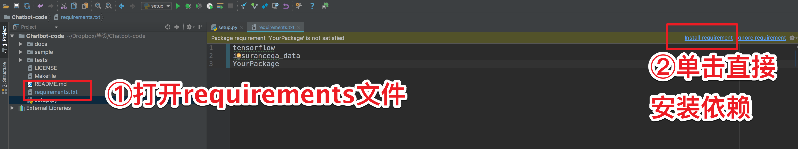
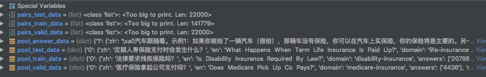
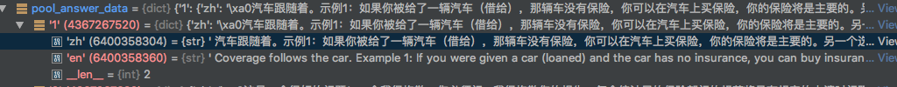
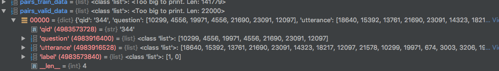
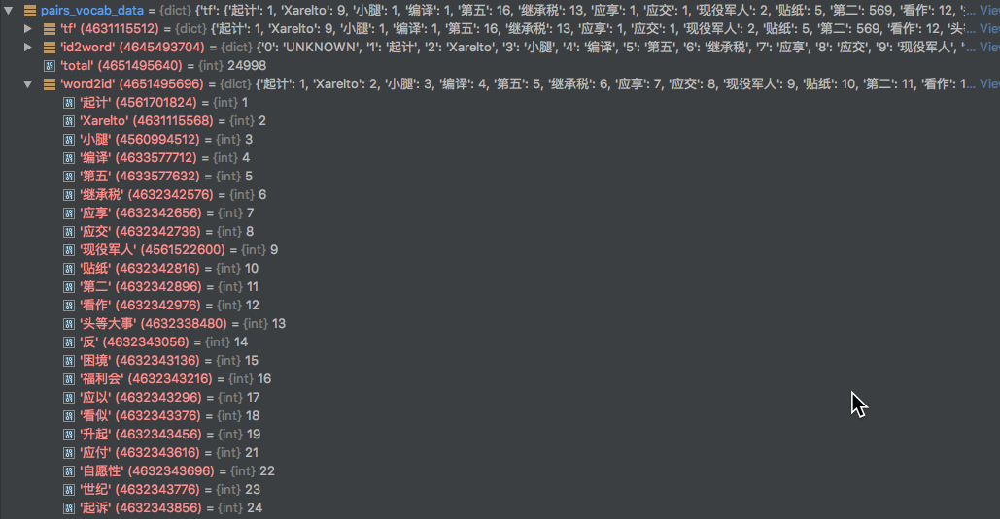
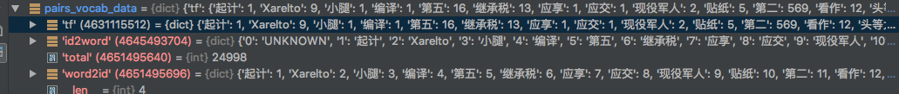

# Chatbot

<!-- ##如何安装依赖
###方法一
在Pycharm集成环境中直接安装

###方法二
命令行
```shell

``` -->

## 项目导入方法

直接使用 Pycharm 导入

## 项目文档结构

```python
# 结巴分词
./sample/jieba # jieba分词源文件

# 保险问答数据库
./sample/insuranceqa_data/__init__.py # 保险问答数据库可用方法
./docs/baseline_article.pdf # 保险问答数据库说明文档

# README相关
./source # READEME图片存储位置
```

## 数据集说明



### pool

pool 前缀为字符串型数据



#### 数据集

```python
load_pool_train   # 训练集
load_pool_valid   # 交叉验证集
load_pool_test    # 测试集
load_pool_answers # 问题答案
```

#### 数据结构

```python
zh # 中文字符串
en # 英文字符串
```

### pair

pair 前缀为字符串型数据

#### 数据集

pair 型数据中, 每个数据集都是"问题"和"答案"的级联



```python
load_pairs_vocab   # 总词汇表(不是数据集)
load_pairs_train   # 训练集
load_pairs_valid   # 交叉验证集
load_pool_test    # 测试集
```

#### 超参数

```python
question_max_length # 模型中问题的最⼤长度
utterance_max_length # 模型中回复的最⼤长度
```

#### Token

```python
<GO> # ⽤来分隔问题和回复
<PAD> # ⽤来补齐问题或回复
```

##### 词汇表



#### 数据结构

```python
tf # 不知道?
id2word # 从id到word的字典索引
word2id # 从word到id的字典索引
```



## 声明

声明 1 : [insuranceqa-corpus-zh](https://github.com/Samurais/insuranceqa-corpus-zh)

本数据集使用翻译 [insuranceQA](https://github.com/shuzi/insuranceQA)而生成，代码发布证书 GPL 3.0。数据仅限于研究用途，如果在发布的任何媒体、期刊、杂志或博客等内容时，必须注明引用和地址。

```
InsuranceQA Corpus, Hai Liang Wang, https://github.com/Samurais/insuranceqa-corpus-zh, 07 27, 2017
```

任何基于[insuranceqa-corpus](https://github.com/Samurais/insuranceqa-corpus-zh)衍生的数据也需要开放并需要声明和“声明 1”和“声明 2”一致的内容。

声明 2 : [insuranceQA](https://github.com/shuzi/insuranceQA)

此数据集仅作为研究目的提供。如果您使用这些数据发表任何内容，请引用我们的论文：[Applying Deep Learning to Answer Selection: A Study and An Open Task](https://arxiv.org/abs/1508.01585)。Minwei Feng, Bing Xiang, Michael R. Glass, Lidan Wang, Bowen Zhou @ 2015
